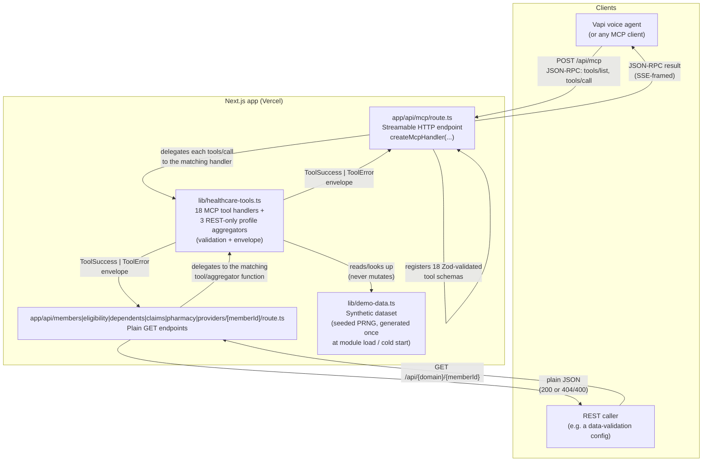

# healthcare-mock-mcp

A **Model Context Protocol (MCP)** server that exposes 18 synthetic
healthcare-administration tools over **Streamable HTTP**, built with
Next.js App Router and [`mcp-handler`](https://www.npmjs.com/package/mcp-handler).
It also exposes a small set of plain **REST `GET` endpoints** over the same
underlying data, for callers that need clean JSON rather than MCP's
JSON-RPC/SSE envelope — e.g. a [data-validation
config](#rest-api-endpoints) that checks values an agent stated during a
conversation against this system of record.

It exists to let a voice/chat agent (e.g. [Vapi](https://vapi.ai)) rehearse
member-service conversations — eligibility checks, benefits lookups, claims
status, pharmacy pricing, case creation — against realistic-shaped data,
**without touching any real PHI**. Every record returned by every tool or
endpoint is fabricated by this repo at startup; nothing is fetched from, or
written to, a real payer, PBM, or EHR system.

> ⚠️ **Not a real healthcare system.** No diagnosis, treatment, dosage
> guidance, medication substitution, emergency dispatch, or real coverage
> determination is performed anywhere in this codebase. See
> [Safety model](#safety-model) below.

---

## Contents

- [Architecture](#architecture)
- [Folder structure](#folder-structure)
- [File-by-file description](#file-by-file-description)
- [How the mock data is built](#how-the-mock-data-is-built)
- [The 18 tools](#the-18-tools)
- [Response envelope & error codes](#response-envelope--error-codes)
- [Running it locally](#running-it-locally)
- [Calling the server manually](#calling-the-server-manually)
- [REST API endpoints](#rest-api-endpoints)
- [Deploying to Vercel](#deploying-to-vercel)
- [Wiring it into Vapi](#wiring-it-into-vapi)
- [Safety model](#safety-model)

---

## Architecture



**Request flow for one MCP tool call:**

1. The MCP client sends `POST /api/mcp` with a JSON-RPC `tools/call` message
   (`{"method":"tools/call","params":{"name":"get_demo_eligibility","arguments":{"memberId":"M1000"}}}`).
2. `mcp-handler` (inside `route.ts`) parses the request, validates the
   arguments against the tool's Zod schema, and invokes the matching
   function in `healthcare-tools.ts`.
3. That function validates required fields, looks up synthetic records in
   `demo-data.ts`, and returns either a `success` envelope with `data`, or
   an `error` envelope with a structured `code`/`message` — it **never**
   fabricates data ad hoc or falls back to a default member.
4. `route.ts` wraps the result as MCP tool-call content and streams it back
   as a JSON-RPC response.

**Request flow for one REST call** (e.g. `GET /api/claims/M1000`): the
dynamic route resolves `memberId` from the URL, calls the matching function
in `healthcare-tools.ts` directly (no JSON-RPC framing), and returns the same
`ToolSuccess`/`ToolError` envelope as plain JSON — `200` on success, `404`
for `member_not_found`, `400` for any other tool error. See
[REST API endpoints](#rest-api-endpoints) for the full list.

There is **no database and no persistence**. The dataset is generated once
per server process (per Vercel cold start) from a fixed seed, so it's
stable within a session but does not survive a redeploy — see
[How the mock data is built](#how-the-mock-data-is-built).

---

## Folder structure

```
healthcare-mock-mcp/
├── app/
│   └── api/
│       ├── mcp/
│       │   └── route.ts                  # MCP Streamable HTTP endpoint (GET/POST/DELETE)
│       ├── members/[memberId]/route.ts   # REST: GET member profile
│       ├── eligibility/[memberId]/route.ts # REST: GET eligibility
│       ├── dependents/[memberId]/route.ts # REST: GET dependents
│       ├── claims/[memberId]/route.ts    # REST: GET claims + accumulators + benefits catalog
│       ├── pharmacy/[memberId]/route.ts  # REST: GET formulary + pharmacies + rx rejections
│       └── providers/[memberId]/route.ts # REST: GET PCP + provider directory
├── lib/
│   ├── demo-data.ts             # Synthetic dataset + lookup helpers
│   └── healthcare-tools.ts      # 18 MCP tool implementations + 3 REST-only
│                                 # profile aggregators + response envelope
├── member-validation-config.json # Example data-validation config for the REST endpoints
├── .gitignore
├── next-env.d.ts                 # Auto-generated by Next.js (gitignored)
├── package.json
├── package-lock.json
└── tsconfig.json
```

## File-by-file description

### `app/api/mcp/route.ts`
The MCP server's entry point.

- Calls `createMcpHandler(registerFn, serverOptions, config)` from
  `mcp-handler`, which builds a single Fetch-API-compatible handler
  supporting **Streamable HTTP** (`POST` for JSON-RPC calls; `GET`/`DELETE`
  to that same path are explicitly rejected — see
  [Calling the server manually](#calling-the-server-manually) for why a
  browser visit to the URL returns a `405`).
- Registers all 18 tools with `server.tool(name, description, zodSchema, handler)`.
  Every argument is declared `.optional()` in the Zod schema — required-ness
  is enforced *inside* each tool function (via `missing_required_parameter`),
  not at the schema layer, so a missing field always comes back as a
  structured tool error rather than an MCP-level schema-validation error.
- Each handler is a one-line delegation: it calls the matching function in
  `healthcare-tools.ts` and wraps the JS object it returns as
  `{ content: [{ type: "text", text: JSON.stringify(result) }] }`, which is
  the MCP content-block shape clients expect.
- Exports `{ handler as GET, handler as POST, handler as DELETE }` — Next.js
  App Router route handlers are one exported function per HTTP verb; all
  three point at the same `mcp-handler`-produced function, which internally
  branches on `request.method`.
- Carries a `TODO` comment marking where an `Authorization` header check
  should be added before this is exposed beyond local/mock evaluation (see
  [Safety model](#safety-model)).

### `app/api/{members,eligibility,dependents,claims,pharmacy,providers}/[memberId]/route.ts`
Six plain REST `GET` endpoints, added alongside the MCP endpoint for
callers that need clean JSON rather than MCP's JSON-RPC/SSE envelope — see
[REST API endpoints](#rest-api-endpoints) for full examples. Each is a
thin, near-identical wrapper:

- Reads `memberId` out of the dynamic route segment (`params` is a
  `Promise` under Next.js 15's App Router), and — for the four "bundle"
  routes (dependents, claims, pharmacy, providers) — spreads every query
  param (`req.nextUrl.searchParams`, via `Object.fromEntries`) into the
  same call. Any new optional filter a tool function starts reading just
  works from the URL automatically; no route file changes needed.
- Calls exactly one function in `healthcare-tools.ts` (`getDemoMember`,
  `getDemoEligibility`, `getDemoDependents`, `getDemoClaimsBenefitsProfile`,
  `getDemoPharmacyProfile`, or `getDemoProviderProfile`) — no business
  logic lives in the route file itself. `getDemoDependents` is the one
  case reusing an existing MCP tool function directly rather than a
  REST-only aggregator, since it already returns exactly the shape needed.
- Returns the function's `ToolSuccess`/`ToolError` envelope as-is via
  `NextResponse.json(result, { status: restErrorStatus(result.error.code) })`
  on failure (every `*_not_found` code → `404`, everything else → `400`) or
  `200` on success. `restErrorStatus` is a small shared helper exported
  from `healthcare-tools.ts` so this mapping stays consistent as new error
  codes get added, instead of being re-implemented per route.
- Same synthetic-only data as the MCP tools (they share the same lookup
  helpers in `demo-data.ts`) — nothing here is a separate data source.

### `lib/healthcare-tools.ts`
The business logic for all 18 MCP tools, plus 3 REST-only aggregator
functions — pure functions, no HTTP concerns.

- **Envelope helpers** (`ok`, `err`) build the two response shapes every
  tool returns: `ToolSuccess<T>` (`success: true`, `data`, `asOf`,
  `warnings`) and `ToolError` (`success: false`, `error: { code, message }`).
  `synthetic: true` and the `tool` name are stamped on every response.
- **`requireString`** — a small validator every tool calls first for each
  required string field. Missing or blank → `missing_required_parameter`.
  This is also the reason **a missing `memberId` never silently defaults to
  a fallback member**: if the field isn't a non-empty string, the function
  returns before any lookup happens.
- **`requireMember`** — wraps `findMember` from `demo-data.ts`; converts a
  miss into `member_not_found`. Used only by the two tools where `memberId`
  is a secondary, optional cross-check (`search_demo_providers`,
  `escalate_demo_conversation`) rather than the primary lookup key.
- **`resolveMember`** — the primary member-identification path, used by
  every tool that needs to find *a* member before doing anything else (14
  of the 18 tools). A caller may identify the member by `memberId`
  (authoritative — looked up alone if present), by full name (`firstName`
  **and** `lastName` together), by `dob`, or any combination of the three.
  At least one complete identifier is required
  (`missing_required_parameter` if none is given); zero matches returns
  `member_not_found`; more than one match (possible only via name/dob,
  since `memberId` is unique) returns `ambiguous_member_match` asking for
  an additional identifier. See [`findMembersByIdentifiers`](#libdemo-datats)
  below for the matching logic.
- **`seededFraction(seed)`** — an FNV-1a-style string hash used wherever a
  tool needs a "random-looking" but **stable** derived number (a cost
  estimate, a pharmacy distance, a confirmation number). Hashing the input
  arguments means calling `estimate_demo_cost` twice with identical
  arguments returns the identical estimate, without needing to persist
  anything.
- **18 exported functions**, one per tool (see [The 18 tools](#the-18-tools)),
  grouped by domain with comment banners: member/eligibility, benefits,
  claims/EOB, pharmacy/PBM, case/escalation.
- The two simulated *write* tools — `simulateDemoAppeal` and
  `createDemoCase` — both check `input.confirmed !== true` and return
  `confirmation_required` if the caller didn't explicitly confirm. Neither
  one persists anything; "creating" a case just means returning a
  deterministically-derived case number.
- **3 REST-only profile aggregators** (`getDemoClaimsBenefitsProfile`,
  `getDemoPharmacyProfile`, `getDemoProviderProfile`) — not registered as
  MCP tools, only consumed by the REST routes. Each bundles several related
  lookups behind one `memberId`-keyed call: the claims/benefits one returns
  a member's full claims history plus their accumulators plus the entire
  benefits catalog; the pharmacy one returns the full formulary, pharmacy
  directory, and all 4 canned prescription-rejection scenarios; the
  provider one resolves the member's `pcpProviderId` to the full provider
  record (name, specialty, location, network status) instead of just the
  ID, plus the full 16-provider directory. All three require an explicit
  return-type annotation (`ToolResult<...>`) rather than relying on
  inference — see the code comment on `requireMember` for why (a real
  `undefined`-narrowing bug was caught here once these results were first
  checked with `.success`/`.error`, which the MCP path never did).
- **Optional narrowing filters** on the four "bundle" functions
  (`getDemoDependents`, `getDemoClaimsBenefitsProfile`,
  `getDemoPharmacyProfile`, `getDemoProviderProfile`) — each accepts extra
  optional `input` fields (`dependentId`, `claimId`/`serviceType`/
  `networkLevel`, `drugName`/`pharmacyId`/`prescriptionReference`,
  `providerId`) that narrow the matching array/list field down to 0-or-1
  entries, mirroring how the single-record MCP tools (`get_demo_claim_details`,
  `get_demo_formulary`, etc.) take an ID as an argument and filter
  server-side rather than making the caller filter a full response
  client-side. `getDemoDependents` is shared with the `get_demo_dependents`
  MCP tool, so that tool gained `dependentId` too; the other three are
  REST-only, so their filters are REST-only. Each filter independently
  returns a domain-specific `*_not_found` error (via `err(...)`) when the
  ID doesn't match, except `pharmacyId`, which returns an empty list — no
  error — mirroring `search_demo_pharmacies`'s existing zero-match
  behavior.
- **`restErrorStatus(code)`** — maps a `ToolError.error.code` to an HTTP
  status for the REST routes: any code ending in `_not_found` → `404`,
  everything else → `400`. Centralizing this means a new `_not_found` code
  (like the `dependent_not_found`/`provider_not_found` added alongside the
  filters above) automatically gets the right status everywhere, without
  touching route files.
- **`prescriptionRejections` is exposed as an array**, not the underlying
  `PRESCRIPTION_REJECTIONS` `Record<string, ...>` — `getDemoPharmacyProfile`
  maps it to `{ reference, code, explanation, nextAction }[]`. This keeps
  it consistent with every other catalog here (array, filterable, always
  `[0]`-addressable after filtering) instead of being the one field whose
  filtered result would need a *dynamic* object key.

### `lib/demo-data.ts`
The synthetic dataset and the only place randomness is generated. See
[How the mock data is built](#how-the-mock-data-is-built) for the full
mechanics.

- A **seeded PRNG** (`mulberry32`) plus two helpers (`pick`, `int`) used to
  generate names, locations, and numeric ranges deterministically.
- Reference lists: `FIRST_NAMES`, `LAST_NAMES`, `CITIES`, `PLANS`,
  `SPECIALTIES` — the raw pools the generators sample from.
- Generated collections, each a `const` array built once at module load:
  `PROVIDERS` (16), `MEMBERS` (20), `DEPENDENTS` (derived from members),
  `ACCUMULATORS` (one entry per member, keyed by `memberId`), `BENEFITS`
  (9 service types × 2 network levels = 18 entries), `CLAIMS` (1–3 per
  member for the first 15 members).
- Two **hand-authored** (non-generated) tables: `FORMULARY` (10 drugs across
  tiers 1–4, including one deliberately `covered: false` entry for testing
  `drug_not_found`-adjacent flows) and `PHARMACIES` (5 pharmacies covering
  retail/mail-order/specialty and all three network categories).
- `PRESCRIPTION_REJECTIONS` — a fixed lookup of 4 canned rejection
  scenarios (`RX-DEMO-0001`..`0004`) covering PA-required, refill-too-soon,
  not-covered, and quantity-limit-exceeded.
- **Lookup helpers** at the bottom (`findMember`, `findMembersByIdentifiers`,
  `findDependents`, `findAccumulators`, `findClaim`, `findClaimsByMember`,
  `findProvider`, `findFormularyEntry`) — the only functions
  `healthcare-tools.ts` imports from this file. Tool code never reaches into
  the raw arrays directly. `findMembersByIdentifiers({ memberId, firstName,
  lastName, dob })` is what backs `resolveMember` (see above): if
  `memberId` is given it's looked up alone (authoritative, unique); otherwise
  it filters `MEMBERS` by whichever of `firstName`/`lastName`/`dob` were
  supplied, case-insensitively for names, and can return 0, 1, or (rarely,
  since first/last names are assigned 1:1 per member in this fixed dataset —
  a DOB collision is the only realistic way to get more than one match)
  multiple matches.

### `package.json`
Standard Next.js scripts (`dev`, `build`, `start`) plus the four runtime
dependencies this project actually needs: `next`, `react`, `react-dom`,
`mcp-handler`, `@modelcontextprotocol/sdk`, `zod`. No test framework, ORM,
or database client — there's nothing to test against except the
deterministic data generator, and nothing to persist.

### `tsconfig.json`
Standard Next.js App Router TypeScript config: `moduleResolution: "bundler"`,
`jsx: "preserve"`, strict mode on, and the `@/*` path alias used by
`route.ts`'s `import * as tools from "@/lib/healthcare-tools"`.

### `next-env.d.ts`
Auto-generated by `next dev`/`next build` on first run. It's listed in
`.gitignore` — don't hand-edit it; if it's ever missing, running the dev
server regenerates it.

### `.gitignore`
Excludes `node_modules/`, `.next/` (build output), `*.tsbuildinfo`,
`next-env.d.ts`, `.env*` (secrets — see [Safety model](#safety-model)), and
`.vercel/` (Vercel CLI's local project link).

---

## How the mock data is built

All synthetic data lives in `lib/demo-data.ts` and is built **once, at
module import time** (i.e., once per server process / Vercel cold start) —
there's no build step, seed script, or database migration to run.

1. **Deterministic randomness.** A [mulberry32](https://github.com/bryc/code/blob/master/jshash/PRNGs.md)
   PRNG is seeded with the fixed literal `20260101`. Two thin wrappers,
   `pick(array)` and `int(min, max)`, are the only way the generators touch
   randomness. Because the seed is a hardcoded constant, **the same 20
   members, 16 providers, and claims come out every time the process
   starts** — useful for demos and for writing tests/scripts against
   specific IDs (`M1000`, `PRV2000`, `CLM5000`, ...) that will always exist.
2. **Providers first** (`PROVIDERS`, 16 entries) — each gets a synthetic
   name (`Dr. {first} {last}`), a specialty, a city, and randomized
   `networkStatus` (80% in-network) / `acceptingNewPatients` (60% true).
   Providers are generated before members because members reference them.
3. **Members** (`MEMBERS`, 20 entries, IDs `M1000`–`M1019`) — name, DOB,
   gender, location, and a random plan (PPO/HMO/EPO) are assigned per
   member. `M1019` (index 19) is **deliberately hardcoded inactive** with a
   termination date, so `get_demo_eligibility`/`coverageStatus` has a
   guaranteed non-active case to demo. Every 4th member (`i % 4 === 0`) gets
   `pcpProviderId: null` to exercise the "no PCP assigned" branch of
   `get_demo_pcp`.
4. **Dependents** (`DEPENDENTS`) — derived from `MEMBERS` via `flatMap`:
   members at every 5th index get 2 dependents (one spouse + one child),
   members at every 3rd index get 1 (a child), everyone else gets 0. This
   guarantees both "member with a spouse" and "member with no dependents"
   cases exist for `get_demo_dependents`.
5. **Accumulators** (`ACCUMULATORS`, keyed by `memberId`) — every member
   gets individual deductible/out-of-pocket progress (`$1,500`/`$6,000`
   limits) with a random amount already "met". Members who have at least
   one dependent also get a family accumulator (`$3,000`/`$12,000`
   limits); members with no dependents get `family: null`.
6. **Benefits** (`BENEFITS`, 18 entries) — built by mapping 9 service types
   (`primary_care_visit`, `emergency_room`, `imaging`, ...) across both
   network levels. In-network entries get a flat copay (except ER, which
   uses 20% coinsurance instead); out-of-network entries always use 40%
   coinsurance, always apply the deductible, and always require prior
   authorization — modeling the usual real-world asymmetry without
   claiming to be a real plan document.
7. **Claims** (`CLAIMS`) — generated only for the **first 15** of the 20
   members (so 5 members have zero claim history, for testing empty-result
   search behavior). Each of those members gets 1–3 claims with a random
   billed amount, an allowed amount computed as 50–80% of billed, a status
   cycled through `submitted → processing → paid → denied`, and a
   `processingHistory` timeline whose last entry only appears once the
   claim reaches `paid` or `denied`.
8. **Formulary and pharmacies** are **not** procedurally generated — they're
   short, hand-written tables (10 drugs, 5 pharmacies) chosen to cover every
   tier (1–4), every requirement flag (PA, step therapy, quantity limit,
   specialty), and one intentionally non-covered drug
   (`experimental-compound-x`), so every branch of `get_demo_formulary` /
   `price_demo_medication` has a matching fixture.
9. **Prescription rejections** are a fixed 4-entry map, since they represent
   canned scenarios (`get_demo_prescription_rejection`) rather than
   naturally-occurring data tied to a member's claim history.

At request time, tool functions never touch these arrays directly — they go
through the **lookup helpers** at the bottom of the file (`findMember`,
`findClaim`, etc.), which is what keeps `healthcare-tools.ts` free of any
array-scanning logic and easy to unit test in isolation if you add tests
later.

**Regenerating the dataset:** there's no separate "build the mock data"
command — it happens automatically every time the Node process starts
(`npm run dev`, `npm run build && npm start`, or a fresh Vercel cold start).
To get a *different* dataset, change the seed literal on the `mulberry32(...)`
call at the top of `demo-data.ts`; to get a *larger* one, change the
`Array.from({ length: N }, ...)` counts for `PROVIDERS`/`MEMBERS`.

---

## The 18 tools

Tools marked **member-identified** accept `memberId` **or** full name
(`firstName` + `lastName`) **or** `dob`, in any combination — see
[Member identification](#member-identification) below. Tools marked
`memberId` (secondary) only use it as an optional cross-check, not a
lookup key.

| Tool | Required inputs | Purpose |
|---|---|---|
| `get_demo_member` | member-identified | Synthetic member's basic profile and plan info |
| `get_demo_eligibility` | member-identified | Coverage status, plan, effective/termination dates |
| `get_demo_dependents` | member-identified | Dependents and their coverage status |
| `get_demo_pcp` | member-identified | PCP assignment, or "no PCP assigned" |
| `search_demo_providers` | `specialty`, `location` | Provider directory search + network status |
| `get_demo_benefits` | member-identified, `serviceType` | Copay, coinsurance, deductible, limits, exclusions, PA requirement |
| `get_demo_accumulators` | member-identified | Individual/family deductible & OOP totals |
| `estimate_demo_cost` | member-identified, `serviceType` | Simulated cost range with assumptions (estimate-only) |
| `search_demo_claims` | member-identified | Claims matching optional filters |
| `get_demo_claim_details` | `claimId` | Detailed claim status, amounts, codes, history |
| `get_demo_eob` | `claimId` | Billed/allowed/plan-paid/disallowed/member-responsibility amounts |
| `simulate_demo_appeal` | member-identified, `claimId`, `reason`, `confirmed` | Simulated appeal submission (requires `confirmed=true`) |
| `get_demo_formulary` | member-identified, `drugName` | Coverage tier, PA, step therapy, quantity limits |
| `price_demo_medication` | member-identified, `drugName`, `daysSupply` | Simulated pricing by pharmacy channel |
| `search_demo_pharmacies` | member-identified, `location` | Pharmacy search with network category & distance |
| `get_demo_prescription_rejection` | member-identified, `prescriptionReference` | Simulated rejection code + explanation + next action |
| `create_demo_case` | member-identified, `category`, `summary`, `confirmed` | Simulated case creation (requires `confirmed=true`) |
| `escalate_demo_conversation` | `reason`, `urgency` | Simulated escalation routing (`memberId` optional cross-check) |

Full argument lists (including optional fields) are declared as Zod schemas
in `app/api/mcp/route.ts`.

### Member identification

The 14 member-identified tools resolve the member from whichever of these
arguments are supplied — **any one is enough**, and supplying more than
one narrows a potential multi-match:

- `memberId` — authoritative; if present, it's looked up alone (`M1000`–`M1019` in the seeded dataset).
- `firstName` **and** `lastName` together (a partial name alone isn't treated as a complete identifier).
- `dob` — `YYYY-MM-DD`, matched exactly against the synthetic member's date of birth.

Providing none of the three returns `missing_required_parameter`; matching
zero members returns `member_not_found`; matching more than one (only
realistically possible via `dob` collision, since first/last names are
assigned 1:1 per member in the seeded dataset) returns
`ambiguous_member_match`.

---

## Response envelope & error codes

Every tool returns one of two shapes:

```jsonc
// success
{
  "success": true,
  "synthetic": true,
  "tool": "get_demo_eligibility",
  "data": { /* tool-specific */ },
  "asOf": "2026-09-09T17:30:00.000Z",
  "warnings": []
}
```

```jsonc
// error
{
  "success": false,
  "synthetic": true,
  "tool": "get_demo_eligibility",
  "error": {
    "code": "member_not_found",
    "message": "No synthetic member matched memberId M9999."
  }
}
```

Error codes in use: `missing_required_parameter`, `member_not_found`,
`ambiguous_member_match`, `claim_not_found`, `claim_member_mismatch`,
`drug_not_found`, `prescription_not_found`, `confirmation_required`,
`conflicting_demo_data`, `dependent_not_found` (REST-only, from the
`dependentId`/`?dependentId=` filter — see [REST API
endpoints](#rest-api-endpoints)), `provider_not_found` (REST-only, from
the `?providerId=` filter).

---

## Running it locally

```bash
npm install
npm run dev
```

The server listens at `http://localhost:3000` — the MCP endpoint is at
`/api/mcp`; the REST endpoints (see [REST API
endpoints](#rest-api-endpoints)) are at `/api/members/{memberId}`,
`/api/eligibility/{memberId}`, `/api/dependents/{memberId}`,
`/api/claims/{memberId}`, `/api/pharmacy/{memberId}`, and
`/api/providers/{memberId}`. You can check it's up with:

```bash
netstat -ano | grep ":3000" | grep LISTENING   # Git Bash
```

> Visiting that URL in a **browser** will show a `405 Method not allowed`
> error — that's expected. Streamable HTTP only accepts `POST` for JSON-RPC
> calls; a browser tab only ever sends `GET`.

---

## Calling the server manually

List all tools:

```bash
curl -s -X POST http://localhost:3000/api/mcp \
  -H "Content-Type: application/json" \
  -H "Accept: application/json, text/event-stream" \
  -d '{"jsonrpc":"2.0","id":1,"method":"tools/list"}'
```

Call one tool:

```bash
curl -s -X POST http://localhost:3000/api/mcp \
  -H "Content-Type: application/json" \
  -H "Accept: application/json, text/event-stream" \
  -d '{"jsonrpc":"2.0","id":1,"method":"tools/call","params":{"name":"get_demo_member","arguments":{"memberId":"M1000"}}}'
```

Pretty-print the result (the response is SSE-framed, so strip the `data: `
prefix before parsing JSON):

```bash
curl -s -X POST http://localhost:3000/api/mcp \
  -H "Content-Type: application/json" \
  -H "Accept: application/json, text/event-stream" \
  -d '{"jsonrpc":"2.0","id":1,"method":"tools/call","params":{"name":"get_demo_member","arguments":{"memberId":"M1000"}}}' \
  | sed -n 's/^data: //p' \
  | node -e "const r=JSON.parse(require('fs').readFileSync(0,'utf8')); console.log(JSON.stringify(JSON.parse(r.result.content[0].text), null, 2))"
```

PowerShell equivalent (list call):

```powershell
Invoke-RestMethod -Uri "http://localhost:3000/api/mcp" -Method Post `
  -ContentType "application/json" `
  -Headers @{ Accept = "application/json, text/event-stream" } `
  -Body '{"jsonrpc":"2.0","id":1,"method":"tools/list"}'
```

**Known-good IDs to try:** members `M1000`–`M1019` (`M1019` is inactive;
`M1000` = Jordan Alvarez, dob `1980-05-24`, so `{"firstName":"Jordan","lastName":"Alvarez"}` or `{"dob":"1980-05-24"}` alone also resolves it),
providers `PRV2000`–`PRV2015`, claims `CLM5000`+ (only members `M1000`–`M1014`
have claims), prescription references `RX-DEMO-0001`–`0004`, formulary drugs
`metformin`, `semaglutide`, `adalimumab`, `experimental-compound-x` (not
covered).

---

## REST API endpoints

Unlike `/api/mcp` (JSON-RPC over Streamable HTTP, `POST` only), these are
plain `GET` routes on the **same** running server — open one directly in a
browser, `curl`, or Postman, no JSON-RPC envelope or SSE framing involved.
They read the same synthetic dataset as the MCP tools (same `demo-data.ts`,
same seed), just returned as flat JSON.

**Start the server first** (see [Running it locally](#running-it-locally)):

```bash
npm run dev
```

Every endpoint takes a `memberId` path segment and returns the tool's
standard envelope:

- Match → `HTTP 200`, `{ "success": true, "synthetic": true, "tool": "...", "data": { ... }, "asOf": "...", "warnings": [] }`
- Unknown `memberId` → `HTTP 404`, `{ "success": false, "synthetic": true, "tool": "...", "error": { "code": "member_not_found", "message": "..." } }`

**Optional server-side filtering.** The four "bundle" endpoints (dependents,
claims, pharmacy, providers) return every record for the member by default,
but each also accepts optional query params that narrow one field down to a
single matching record — mirroring how the corresponding MCP tool takes
that same ID as an argument and does the lookup server-side, rather than
returning everything and expecting the caller to filter it out
client-side. A filtered response keeps the same shape (still an array/list
field), just with 0-or-1 items, so `[0]` always addresses "the requested
record, or the first one if no filter was given." An unmatched ID on most
filters returns `404` with a dedicated `_not_found` error code (exception:
`?pharmacyId=` mirrors `search_demo_pharmacies` and returns an empty list
instead of erroring). See each domain section below for its specific
params.

**Known-good IDs:** members `M1000`–`M1019` (`M1019` is inactive); claims
`CLM5000`+ (only `M1000`–`M1014` have claims — see the claims/benefits
response for exact IDs per member).

**Live deployment:** `https://healthcare-mock-mcp.vercel.app` — every
example below works against it as-is, or swap in `http://localhost:3000`
for a local dev server.

| # | Domain | Method & path | Underlying tool function | Bundles | Optional filter query params |
|---|---|---|---|---|---|
| 1 | Member | `GET /api/members/{memberId}` | `getDemoMember` | Profile + plan | — (already a single record) |
| 2 | Eligibility | `GET /api/eligibility/{memberId}` | `getDemoEligibility` | Coverage status + plan dates | — (already a single record) |
| 3 | Dependents | `GET /api/dependents/{memberId}` | `getDemoDependents` | Spouse/child records + their coverage status | `dependentId` |
| 4 | Claims & Benefits | `GET /api/claims/{memberId}` | `getDemoClaimsBenefitsProfile` | Claims history + accumulators + benefits catalog | `claimId`; `serviceType` (+ optional `networkLevel`, defaults to `in_network`) |
| 5 | Pharmacy/PBM | `GET /api/pharmacy/{memberId}` | `getDemoPharmacyProfile` | Formulary + pharmacy directory + prescription rejections | `drugName`; `pharmacyId`; `prescriptionReference` |
| 6 | Providers | `GET /api/providers/{memberId}` | `getDemoProviderProfile` | PCP assignment (resolved to full provider record) + provider directory | `providerId` |

### 1. Member domain — `GET /api/members/{memberId}`

Basic profile and plan info: `memberId`, `firstName`, `lastName`, `dob`,
`gender`, `location`, `plan`, `coverageStatus`, `pcpProviderId`.

```bash
curl -s https://healthcare-mock-mcp.vercel.app/api/members/M1000
```

```powershell
Invoke-RestMethod -Uri "https://healthcare-mock-mcp.vercel.app/api/members/M1000" -Method Get
```

Example response (`M1000`):

```jsonc
{
  "success": true,
  "synthetic": true,
  "tool": "get_demo_member",
  "data": {
    "memberId": "M1000",
    "firstName": "Jordan",
    "lastName": "Alvarez",
    "dob": "1980-05-24",
    "gender": "F",
    "location": { "city": "Cedar Hollow", "state": "NC", "zip": "27601" },
    "plan": {
      "name": "Synthetic PPO Gold",
      "type": "PPO",
      "effectiveDate": "2026-01-01",
      "terminationDate": null
    },
    "coverageStatus": "active",
    "pcpProviderId": null
  },
  "asOf": "2026-09-14T00:42:46.743Z",
  "warnings": []
}
```

### 2. Eligibility domain — `GET /api/eligibility/{memberId}`

Coverage status, plan, effective/termination dates, and data timestamp:
`memberId`, `coverageStatus`, `plan`, `effectiveDate`, `terminationDate`,
`dataTimestamp`.

```bash
curl -s https://healthcare-mock-mcp.vercel.app/api/eligibility/M1000
```

```powershell
Invoke-RestMethod -Uri "https://healthcare-mock-mcp.vercel.app/api/eligibility/M1000" -Method Get
```

Example response (`M1000`):

```jsonc
{
  "success": true,
  "synthetic": true,
  "tool": "get_demo_eligibility",
  "data": {
    "memberId": "M1000",
    "coverageStatus": "active",
    "plan": {
      "name": "Synthetic PPO Gold",
      "type": "PPO",
      "effectiveDate": "2026-01-01",
      "terminationDate": null
    },
    "effectiveDate": "2026-01-01",
    "terminationDate": null,
    "dataTimestamp": "2026-09-09T00:00:00.000Z"
  },
  "asOf": "2026-09-14T00:42:51.422Z",
  "warnings": []
}
```

Try `M1019` to see the inactive-coverage case (`coverageStatus: "inactive"`,
a non-null `terminationDate`).

### 3. Dependents domain — `GET /api/dependents/{memberId}`

A member's spouse/child records and their coverage status: `memberId`,
`dependents[]` (each with `dependentId`, `memberId`, `name`,
`relationship`, `dob`, `coverageStatus`).

**Optional query param:** `dependentId` — narrows `dependents[]` to the one
matching entry. `404 dependent_not_found` if it doesn't belong to this
member. E.g. `?dependentId=M1000-D2`.

```bash
curl -s https://healthcare-mock-mcp.vercel.app/api/dependents/M1000
```

```powershell
Invoke-RestMethod -Uri "https://healthcare-mock-mcp.vercel.app/api/dependents/M1000" -Method Get
```

Example response (`M1000`, who has 2 dependents — every 5th member does):

```jsonc
{
  "success": true,
  "synthetic": true,
  "tool": "get_demo_dependents",
  "data": {
    "memberId": "M1000",
    "dependents": [
      {
        "dependentId": "M1000-D1",
        "memberId": "M1000",
        "name": "Emerson Alvarez",
        "relationship": "spouse",
        "dob": "2019-03-28",
        "coverageStatus": "active"
      },
      {
        "dependentId": "M1000-D2",
        "memberId": "M1000",
        "name": "Morgan Alvarez",
        "relationship": "child",
        "dob": "202-08-14",
        "coverageStatus": "active"
      }
    ]
  },
  "asOf": "2026-09-14T14:56:35.256Z",
  "warnings": []
}
```

> **Known data-generator bug:** some dependent `dob` values come out
> un-padded (`"202-08-14"` above should be `"2002-08-14"`) — the generator
> at [demo-data.ts:133](lib/demo-data.ts#L133) builds the year as
> `` `20${int(2, 20)}` `` without zero-padding `int(2, 20)` to 2 digits, so
> single-digit results (2-9) drop a character. Left as-is for now since
> fixing it would shift the seeded PRNG sequence and change every
> downstream "random" value in the dataset.

Members at every 3rd index get 1 dependent (a child, no spouse); everyone
else gets `dependents: []` — useful for testing the empty-result case.

### 4. Claims & Benefits domain — `GET /api/claims/{memberId}`

Bundles three related lookups for one member: their full claims history,
their individual/family accumulators, and the entire 18-entry benefits
catalog (9 service types × 2 network levels — not member-specific, but
included for reference): `memberId`, `claims[]`, `accumulators`,
`benefitsCatalog[]`.

**Optional query params** (independent — combine freely in one request):
- `claimId` — narrows `claims[]` to the one matching entry. `404 claim_not_found` if it doesn't belong to this member.
- `serviceType` (+ optional `networkLevel`, defaults to `in_network`) — narrows `benefitsCatalog[]` to the one matching entry. `400 conflicting_demo_data` if no such entry exists.

E.g. `?claimId=CLM5031&serviceType=imaging&networkLevel=out_of_network`.

```bash
curl -s https://healthcare-mock-mcp.vercel.app/api/claims/M1000
```

```powershell
Invoke-RestMethod -Uri "https://healthcare-mock-mcp.vercel.app/api/claims/M1000" -Method Get
```

Example response (`M1000`, truncated — `claims` has 3 entries and
`benefitsCatalog` has 18; one of each is shown):

```jsonc
{
  "success": true,
  "synthetic": true,
  "tool": "get_demo_claims_benefits_profile",
  "data": {
    "memberId": "M1000",
    "claims": [
      {
        "claimId": "CLM5000",
        "memberId": "M1000",
        "serviceDate": "2026-05-07",
        "providerName": "Dr. Riley Quintero",
        "status": "submitted",
        "codes": { "cpt": "99214", "diagnosis": "J06.9" },
        "billedAmount": 3992,
        "allowedAmount": 3090,
        "planPaidAmount": 2472,
        "memberResponsibility": 618,
        "processingHistory": [
          { "date": "2026-08-01", "status": "received", "note": "Claim received from provider." },
          { "date": "2026-08-05", "status": "processing", "note": "Under adjudication review." }
        ]
      }
      // ...2 more claims (CLM5001, CLM5002)
    ],
    "accumulators": {
      "memberId": "M1000",
      "individual": {
        "deductible": { "limit": 1500, "met": 763, "remaining": 737 },
        "outOfPocket": { "limit": 6000, "met": 1832, "remaining": 4168 }
      },
      "family": {
        "deductible": { "limit": 3000, "met": 2590, "remaining": 410 },
        "outOfPocket": { "limit": 12000, "met": 5450, "remaining": 6550 }
      }
    },
    "benefitsCatalog": [
      {
        "serviceType": "primary_care_visit",
        "networkLevel": "in_network",
        "copay": 41,
        "coinsurance": null,
        "deductibleApplies": false,
        "limits": null,
        "exclusions": [],
        "priorAuthorizationRequired": false
      }
      // ...17 more entries (9 service types x 2 network levels)
    ]
  },
  "asOf": "2026-09-14T00:42:51.615Z",
  "warnings": []
}
```

Members `M1015`–`M1019` have zero claims (`claims: []`) — useful for
testing empty-result handling. Members with no dependents get
`accumulators.family: null`.

### 5. Pharmacy/PBM domain — `GET /api/pharmacy/{memberId}`

Bundles the full 10-drug formulary, the full 5-pharmacy directory, and all
4 canned prescription-rejection scenarios. `memberId` only gates access
(must be a valid member) — the catalogs themselves aren't member-specific:
`memberId`, `formulary[]`, `pharmacies[]`, `prescriptionRejections[]`.

**Optional query params** (independent — combine freely in one request):
- `drugName` — narrows `formulary[]` to the one matching entry. `404 drug_not_found` if it doesn't exist.
- `pharmacyId` — narrows `pharmacies[]` to the one matching entry. No error on zero matches (returns `pharmacies: []`), mirroring `search_demo_pharmacies`.
- `prescriptionReference` — narrows `prescriptionRejections[]` to the one matching entry. `404 prescription_not_found` if it isn't one of the canned references (`RX-DEMO-0001`–`0004`).

E.g. `?drugName=lisinopril&pharmacyId=PHM03`.

```bash
curl -s https://healthcare-mock-mcp.vercel.app/api/pharmacy/M1000
```

```powershell
Invoke-RestMethod -Uri "https://healthcare-mock-mcp.vercel.app/api/pharmacy/M1000" -Method Get
```

Example response (`M1000`, truncated — `formulary` has 10 entries,
`pharmacies` has 5, and `prescriptionRejections` has 4; one of each is
shown):

```jsonc
{
  "success": true,
  "synthetic": true,
  "tool": "get_demo_pharmacy_profile",
  "data": {
    "memberId": "M1000",
    "formulary": [
      {
        "drugName": "metformin",
        "strength": "500mg",
        "form": "tablet",
        "tier": 1,
        "priorAuthorizationRequired": false,
        "stepTherapyRequired": false,
        "quantityLimit": null,
        "specialtyRequired": false,
        "covered": true
      }
      // ...9 more drugs, including "experimental-compound-x" (covered: false)
    ],
    "pharmacies": [
      {
        "pharmacyId": "PHM01",
        "name": "Corner Health Pharmacy",
        "location": { "city": "Springvale", "state": "OH", "zip": "44001" },
        "type": "retail",
        "networkCategory": "preferred",
        "mailOrderAvailable": false
      }
      // ...4 more pharmacies (PHM02-PHM05)
    ],
    "prescriptionRejections": [
      {
        "reference": "RX-DEMO-0001",
        "code": "PA_REQUIRED",
        "explanation": "This medication requires prior authorization before it can be filled.",
        "nextAction": "Ask the prescriber to submit a prior authorization request."
      }
      // ...3 more (RX-DEMO-0002, -0003, -0004)
    ]
  },
  "asOf": "2026-09-14T00:42:52.370Z",
  "warnings": []
}
```

`formulary` includes `experimental-compound-x` (`covered: false`) for
testing not-covered flows. `prescriptionRejections` is an **array** (each
entry carries its own `reference` field), not an object keyed by
reference — this keeps it consistent with every other catalog here and
lets a filtered result always be addressed at `[0]` regardless of which
reference was requested.

### 6. Providers domain — `GET /api/providers/{memberId}`

Resolves the member's `pcpProviderId` to the actual provider record — the
member and eligibility responses only expose the bare ID — plus the full
16-provider directory: `memberId`, `pcpAssigned`, `pcp` (`null` if
unassigned), `providerDirectory[]`.

**Optional query param:** `providerId` — narrows `providerDirectory[]` to
the one matching entry (independent of the member's own `pcp`, which is
never filtered). `404 provider_not_found` if it doesn't exist. E.g.
`?providerId=PRV2005`.

```bash
curl -s https://healthcare-mock-mcp.vercel.app/api/providers/M1001
```

```powershell
Invoke-RestMethod -Uri "https://healthcare-mock-mcp.vercel.app/api/providers/M1001" -Method Get
```

Example response (`M1001`, truncated — `providerDirectory` has 16 entries;
one is shown):

```jsonc
{
  "success": true,
  "synthetic": true,
  "tool": "get_demo_provider_profile",
  "data": {
    "memberId": "M1001",
    "pcpAssigned": true,
    "pcp": {
      "providerId": "PRV2011",
      "name": "Dr. Sawyer Lindqvist",
      "specialty": "Physical Therapy",
      "location": { "city": "Lakeport", "state": "MN", "zip": "55401" },
      "networkStatus": "in_network",
      "acceptingNewPatients": true
    },
    "providerDirectory": [
      {
        "providerId": "PRV2000",
        "name": "Dr. Reese Quintero",
        "specialty": "Physical Therapy",
        "location": { "city": "Rivermont", "state": "TX", "zip": "75201" },
        "networkStatus": "in_network",
        "acceptingNewPatients": true
      }
      // ...15 more providers (PRV2001-PRV2015)
    ]
  },
  "asOf": "2026-09-14T01:34:54.652Z",
  "warnings": []
}
```

Every 4th member (`M1000`, `M1004`, `M1008`, ...) has no PCP assigned —
try `M1000` to see `pcpAssigned: false, pcp: null` while
`providerDirectory` is still returned in full.

### Error example — unknown memberId

Every endpoint returns the same shape for a `memberId` that doesn't exist
in the synthetic dataset:

```bash
curl -s -w "\nHTTP %{http_code}\n" https://healthcare-mock-mcp.vercel.app/api/members/M9999
```

```jsonc
{
  "success": false,
  "synthetic": true,
  "tool": "get_demo_member",
  "error": {
    "code": "member_not_found",
    "message": "No synthetic member matched the supplied identifiers."
  }
}
// HTTP 404
```

### Using these with a data-validation config

[`member-validation-config.json`](./member-validation-config.json) in the
repo root is a worked example. It declares all six endpoints above,
sourcing `member_id` plus one optional lookup key per filterable field
(`dependent_id`, `claim_id`, `service_type`/`network_level`, `drug_name`,
`pharmacy_id`, `prescription_reference`, `provider_id`) from a test
profile, and passes each of those straight through as a **query param** on
the matching endpoint's `url` (e.g.
`.../api/claims/{{member_id}}?claimId={{claim_id}}&serviceType={{service_type}}&networkLevel={{network_level}}`).
Every `json_path` then reads a fixed index (`[0]`, plus `[1]`/`[2]` for
dependents/claims, since a member can have more than one) rather than a
JSONPath filter predicate — the server does the narrowing, not the
validator.

This design exists because JSONPath `?()` filter expressions
(`$.data.claims[?(@.claimId=='...')]`) turned out not to work against this
particular validation tool — its own documented examples were all plain
paths/indices, never filters, and testing confirmed filter predicates
silently match nothing. Query-param filtering sidesteps that entirely: it
mirrors how the MCP tools already take an ID as an *argument* and do the
lookup server-side, so the REST layer now does the same, and the validator
only ever needs the simple path forms it's confirmed to support. Leaving a
lookup key unset in the test profile (e.g. no `claim_id`) makes the
endpoint fall back to returning every record unfiltered, so `[0]`/`[1]`
still resolve to *something* meaningful — the first claim, first
dependent, the default drug (metformin), etc. — each documented in that
variable's `description` in the config. Its URLs point at the live
deployment, `https://healthcare-mock-mcp.vercel.app` — swap that for
`localhost:3000` to run it against a local dev server instead.

---

## Deploying to Vercel

This repo has no Vercel-specific config beyond being a standard Next.js
app — `vercel.json` isn't required.

1. Push to GitHub (already done — see repo history).
2. In the [Vercel dashboard](https://vercel.com/new), import the
   `healthcare-mock-mcp` GitHub repo, or run `npx vercel` from this folder
   to deploy via CLI.
3. Once deployed, your MCP endpoint is
   `https://<your-project>.vercel.app/api/mcp`, and the REST endpoints are
   at `https://<your-project>.vercel.app/api/{members,eligibility,dependents,claims,pharmacy,providers}/{memberId}`.
4. Before sharing those URLs beyond a local/mock evaluation, add the
   authorization check noted in the `TODO` at the top of
   `app/api/mcp/route.ts` — and equivalently to the REST routes, which
   currently carry no auth check either (see [Safety model](#safety-model)).

---

## Wiring it into Vapi

```json
{
  "type": "mcp",
  "server": {
    "url": "https://YOUR-PROJECT.vercel.app/api/mcp"
  },
  "metadata": {
    "protocol": "shttp"
  }
}
```

Use Streamable HTTP (`shttp`) as shown — not `stdio` (local-process only)
or legacy SSE (only needed for clients that can't do Streamable HTTP).

---

## Safety model

- **All data is synthetic.** Names, dates of birth, claims, and formulary
  entries are procedurally generated or hand-authored fixtures — none of it
  corresponds to a real person, provider, or plan.
- **No PHI is stored or transmitted.** There is no database; the dataset
  lives in memory for the life of the server process.
- **Administrative simulation only.** Nothing in `healthcare-tools.ts`
  performs or implies diagnosis, treatment, dosage changes, medication
  substitution, emergency dispatch, or a real coverage determination.
- **Confirmation-gated writes.** The only two tools that simulate a
  state change (`create_demo_case`, `simulate_demo_appeal`) require an
  explicit `confirmed: true` argument and return `confirmation_required`
  otherwise; even when confirmed, nothing is actually persisted.
- **No default member.** Every member-identified tool fails with
  `missing_required_parameter` unless it receives at least one complete
  identifier (`memberId`, full name, or `dob`) — the server never guesses
  or substitutes a fallback identity.
- **Before exposing this beyond local/mock evaluation:** add an
  `Authorization` header check in `app/api/mcp/route.ts` **and** in each of
  the six REST route files under `app/api/{members,eligibility,dependents,claims,pharmacy,providers}/[memberId]/`,
  backed by a Vercel environment variable and a matching Vapi secure
  credential / data-validation-config header. Never put the secret in the
  URL or in a tool's description string. None of these routes currently
  check authorization — see the `TODO` in `app/api/mcp/route.ts`.
